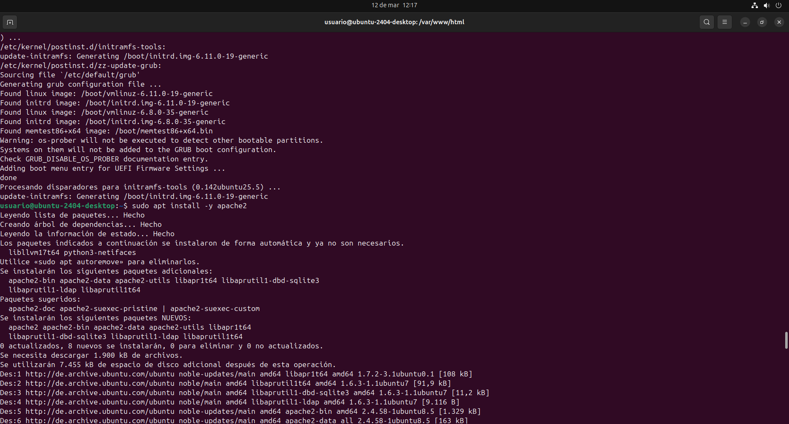
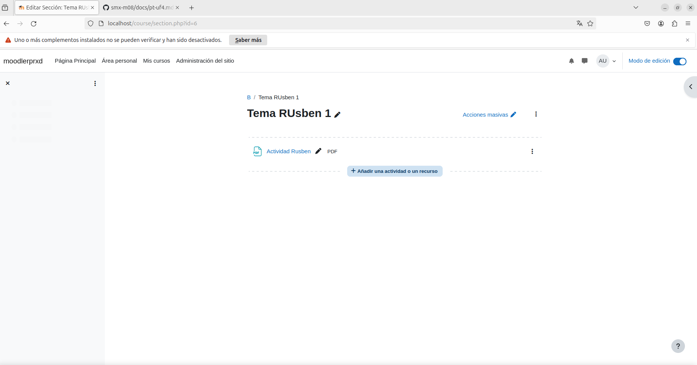

## Terminal - Inicio del Proceso

Las primeras tres imágenes corresponden a la terminal, donde se inician los comandos necesarios para comenzar:

- **1.png**  
  Inicio de la terminal. Preparación del entorno.

- **2.png**  
  Terminal descarga

- **3.png**  
  Confirmación de que el entorno está correctamente configurado.

## Proceso Visual (4.png - 29.png)

A continuación se muestran las capturas que reflejan los ejercicios del moodle:

- **4.png a 10.png**  
  Configuración inicial y carga de recursos.

